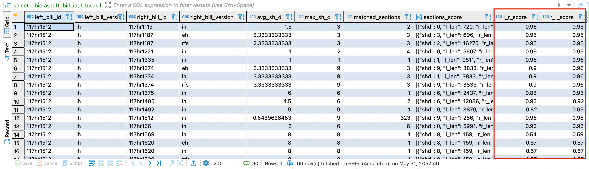

= bill-similarity
:toc:
This document contains an explanation of the results of the investigation of similarity search among Bills using simhashes and pure SQL techniques.

== Brief description

We have investigated the challenge of searching for similar bills among tens of thousands of documents and focused on two different techniques:

- https://github.com/arachnidllc/bill-similarity/blob/investigate_simhashes/investigate/README.adoc[SimHash Approach] :
Uses SimHashes (fingerprints) of every document and searching among similar fingerprints with adjustable measure of similarity.
- https://github.com/arachnidllc/bill-similarity/blob/investigate_simhashes/docs/SQL_APPROACH.adoc[SQL Approach]:
Pure SQL queries with installation of the additional extensions for the database to support similarity search and building efficient indexes in DB;

Each of these approaches has their pros and cons - for example with SimHashes we can find similar documents quickly, but we can't calculate asymmetric similarity metrics between pairs of documents (the similarity scores, see xref:How does it work?[below]). Meanwhile, the pure SQL approach can calculate metrics, but is much more sensitive to the size of the DB and text length and may become significantly slower as the dataset grows, due to multiple joins.

Through combining both approaches, we can achieve excellent high-performance results and get full information with metrics in an elegant way. We use simhashes as a pre-processing step to significantly reduce the number of rows fetched from the DB to calculate their similarity scores with db extensions.

=== Explanation of SimHash and SQL approaches

To get a more detailed explanation of each technique please see the corresponding documentation:

    - https://github.com/arachnidllc/bill-similarity/blob/investigate_simhashes/docs/SQL_APPROACH.adoc[Searching similars with SQL]

    - https://github.com/arachnidllc/bill-similarity/blob/investigate_simhashes/investigate/README.adoc[Searching similars with SimHashes]

== Steps to reproduce locally

=== 1. Installation of the extensions for the DB
We need some extensions for the PostgreSQL to support similarity search, and to create indexes, that increase performance of our queries.
See instructions in SQL Approach documentation.
+++ 

 +++
View detailed steps :
+++ 

 +++
CAUTION:  need superuser access to DB

==== 1.1. Install `smlar` plugin
* clone `https://github.com/jirutka/smlar`
* from the smlar folder run commands:
`$ USE_PGXS=1 make`

`$ USE_PGXS=1 make install`

==== 1.2 Create extension smlar
* enter postgres command line:
run `psql`

* connect to your database : `\c bills`.
_bills_ - is a database name.

* create extension with command:
`CREATE EXTENSION smlar`

* Settings for `smlar`
----
set
   smlar.threshold = 0.6;

set
   smlar.persistent_cache = on;

set
   smlar.type = "cosine";
----

==== 1.3 Add functions into DB
* run command in postgres command line:
----
CREATE OR REPLACE FUNCTION array_to_col(anyarray)
RETURNS SETOF anyelement AS
$$
    SELECT $1[n]
    FROM generate_series(1, array_upper($1, 1) - array_lower($1, 1) + 1) AS n;
$$ LANGUAGE SQL RETURNS NULL ON NULL INPUT IMMUTABLE;
----
* run command in postgres command line:
----
CREATE OR REPLACE FUNCTION word_ngrams(str text, n integer) RETURNS text[]
   immutable
   strict
   language plpgsql
as
$$
declare
   i      int;
   arr    text[];
   result text[];
   q      text[];
begin
   arr := regexp_split_to_array(lower(str), '[^[:alnum:]]+');
   IF cardinality(arr) <= n THEN
       return ARRAY [lower(str)];
   END IF;
   for i in 1 .. cardinality(arr) - n + 1
       loop
           q := arr[i : i + n - 1];
           IF result IS NULL THEN
               result := ARRAY [array_to_string(q, ' ')];
           ELSE
               /* append with "or" */
               result := result || array_to_string(q, ' ');
           END IF;
       end loop;
   return result;
end
$$;
----

+++ 

 +++

=== 2. Installation of python packages
From the project root folder run `pip install -r investigate/requirements.txt`.
it will install all dependencies, required to run python scripts.
You also need to specify some settings for the DB connections and file storage pathes, see instructions in Simhash Approach documentation.

=== 3. Preparing data in database
To use similarity search in PostgreSQL we need to extend existing data for the bills with some additional fields and indexes, such as:

- binary strings to store SimHash of the text/title
- arrays of the n-grams to store features (sorted n-grams) of the text to use in similarities score calculations

We also need to build indexes and create SQL functions stored in db, that we then will use in our queries.

Full explanation of the data types used in db tables and orm models see in corresponding documentation.

(TODO): make data preparation in a single run.
(TODO for further usage only): modify parsers/workers, so they fill all necessary fields on creating new instances or add such data processing as a separate worker (task) in the pipeline.

+++ 

 +++
View detailed steps and commands:
+++ 

 +++

==== 3.1 Add required column:
----
alter table sections alter column text_query_index_col type text[]
  using text_query_index_col::text[];
----
==== 3.2. Populate column with data
----
update
  sections
set
  text_query_index_col = array_unique(word_ngrams(text, 4))
where
  id in (
  select
     id
  from
     sections
  where
     parent_id is null
     and text_query_index_col is null
  order by
     length desc
)
----
==== 3.3  Create indexes in DB
----
create index parent_is_null_text_query_index_col_siml_gist_idx
   on
       sections
           using GIST (text_query_index_col _text_sml_ops)
   where
       parent_id is null;

create index parent_is_null_text_query_index_col_siml_gist_idx
   on sections using gist (text_query_index_col _text_sml_ops)
   where (parent_id IS NULL);

create index bill_id__bill_version__parent_null
   on sections (bill_id, bill_version)
   where (parent_id IS NULL);
----
+++ 

 +++

=== 4. Running search queries to test
After you have all previous steps completed you can retrieve results of similarity search with scores with sql queries as follows.

==== 4.1 Query to search similar for the single bill:
----
select l_bid                                                as left_bill_id,
      l_bv                                                 as left_bill_version,
      r_bid                                                as right_bill_id,
      r_bv                                                 as right_bill_version,
      avg(sh)                                              as avg_sh_d,
      max(sh)                                              as max_sh_d,
      jsonb_array_length(jsonb_agg(lr_dist)::jsonb)        as matched_sections,
      jsonb_agg(lr_dist)                                   as sections_score,
      round(avg(smlar(l_w, r_w, 'N.i / N.a')::numeric), 2) as l_r_score,
      round(avg(smlar(l_w, r_w, 'N.i / N.b'))::numeric, 2) as r_l_score
from (
        select CONCAT(greatest(l.id, r.id), '-', least(l.id, r.id)) as uid,
               l.bill_id                                               l_bid,
               l.bill_version                                          l_bv,
               r.bill_id                                               r_bid,
               r.bill_version                                          r_bv,
               l.text_query_index_col                                  l_w,
               r.text_query_index_col                                  r_w,
               bit_count(r.simhash_text # l.simhash_text)           as sh,
               json_build_object(
                       'left_right_score',
                       ROUND(smlar(l.text_query_index_col, r.text_query_index_col, 'N.i / N.a')::numeric, 6),
                       'right_left_score',
                       ROUND(smlar(r.text_query_index_col, l.text_query_index_col, 'N.i / N.a')::numeric, 6),
                       'shd', bit_count(r.simhash_text # l.simhash_text),
                       'left_section_id', l.id,
                       'right_section_id', r.id,
                       'l_len', l.length,
                       'r_len', r.length
                   )::jsonb                                         as lr_dist
        from (
                 select *
                 from sections
                 where parent_id is null
                   and bill_id = '117hr1512'
                   and bill_version ='ih'
             ) l
                 join (
            select *
            from sections
            where parent_id is null
        ) r on
            bit_count(r.simhash_text # l.simhash_text) < 10
--           and r.words % l.words
    ) as t
        left join xml_bills l_b on
           l_b.bill_number = t.l_bid
       and l_b.bill_version = l_bv
        left join xml_bills r_b on
           r_b.bill_number = t.r_bid
       and r_b.bill_version = r_bv
group by l_bid,
        l_bv,
        r_bid,
        r_bv
----
TIP: This part of the query selects the unique bill that you want to compare with others `... and bill_id = '117hr1512' and bill_version ='ih'...`

The result of the query will lok like:

, where you can see the scores of the similarity from left to right and from right to left.

==== 4.2 Query to create materialized view

Materialized views are stored results of the "heavy" queries, which can be used to get secondary results. Once materialized view was created and stored you may quickly fetch the rows from it as from regular table.

We can create a Materialized view with the result of the similarity scores between each to each sections/bills, and update it regularly with cron.

The query below can take hours to execute:
----
 create table section_to_section_cosine as (
 CREATE MATERIALIZED VIEW section_to_section_cosine AS (
select l_bid                                                as left_bill_id,
      l_bv                                                 as left_bill_version,
      r_bid                                                as right_bill_id,
      r_bv                                                 as right_bill_version,
      avg(sh)                                              as avg_sh_d,
      max(sh)                                              as max_sh_d,
      jsonb_array_length(jsonb_agg(lr_dist)::jsonb)        as matched_sections,
      jsonb_agg(lr_dist)                                   as sections_score,
      round(avg(smlar(l_w, r_w, 'N.i / N.a')::numeric), 2) as l_r_score,
      round(avg(smlar(l_w, r_w, 'N.i / N.b'))::numeric, 2) as r_l_score,
      l_b.length                                           as left_bill_length,
      r_b.length                                           as right_bill_length
from (
        select CONCAT(greatest(l.id, r.id), '-', least(l.id, r.id)) as uid,
               l.bill_id                                               l_bid,
               l.bill_version                                          l_bv,
               r.bill_id                                               r_bid,
               r.bill_version                                          r_bv,
               l.text_query_index_col                                  l_w,
               r.text_query_index_col                                  r_w,
               bit_count(r.simhash_text # l.simhash_text)           as sh,
               json_build_object(
                       'left_right_score',
                       ROUND(smlar(l.text_query_index_col, r.text_query_index_col, 'N.i / N.a')::numeric, 6),
                       'right_left_score',
                       ROUND(smlar(r.text_query_index_col, l.text_query_index_col, 'N.i / N.a')::numeric, 6),
                       'shd', bit_count(r.simhash_text # l.simhash_text),
                       'left_section_id', l.id,
                       'right_section_id', r.id,
                       'l_len', l.length,
                       'r_len', r.length
                   )::jsonb                                         as lr_dist
        from (
                 select *
                 from sections
                 where parent_id is null
             ) l
                 join (
            select *
            from sections
            where parent_id is null
        ) r on
            bit_count(r.simhash_text # l.simhash_text) < 10
    ) as t
        left join bill l_b on
           l_b.billnumber = t.l_bid
       and l_b."version" = l_bv
        left join bill r_b on
           r_b.billnumber = t.r_bid
       and r_b."version" = r_bv
group by l_bid,
        l_bv,
        r_bid,
        r_bv,
        l_b.length,
        r_b.length
order by matched_sections desc,
        avg_sh_d,
        max_sh_d desc,
        l_r_score desc,
        r_l_score desc
 )

----

== How does it work?

Once database has all additional columns filled and indexes for them have been built, it is quite stable and fast to find similar documents and order them by relevance.

The main idea here is to fetch the most relevant data with quick and "light" part of the query, and then process only those documents with the "heavy" part of the query.

First, we filter all documents that are similar to the current document using SimHash (fingerprint). See this part of the query listed above: `... bit_count(r.simhash_text # l.simhash_text) < 10...` . We can adjust the threshold to grab more documents if we want and have wider search results, that will appear on the "second page". Thus, we ignore the majority of the database in further more complex processing, e.g. those documents that will have zero or close to zero similarity scores because they will have more difference between SimHashes.

Simhash is a locality-sensitive hashing mechanism (see documentation), that builds close or even identical hashes for similar documents. Counting bitwise XOR for bit strings is pretty fast operation, that's why it performs quickly, and it depends only on the size of DB and is independent of the texts' length.

Another part of the query then operates with filtered part of the documents performing calculations of the asymmetric similarity scores between documents using DB extensions and stored functions that we created.

_Asymmetric score_  here means that similarity measure between two documents is counted not just like distance (that is a _symmetric_ measure, like Jaccard distance, Hamming distance or similarity in percents when `diff(A, B) == diff(B, A)`), but as two values that represent how much each document similar to another. In this case `diff(A, B) != diff(B, A)`.

With a symmetric score we can say that two documents have 93.5% similarity, and it works vice versa.

With an asymmetric score we can say that the difference between `A and B` is 98.5% , while difference between `B and A` is 65.2%.
It is very useful, if document `A` contains almost full document `B` inside, while `B` is only a part of bigger `A`.

The "Smlar" extension for PostgreSQL we have installed above is used to perform these calculations, and it is based on calculating cosine difference between arrays, while arrays representing each document are n-grams that are also stored in database and created with functions that we added.

It is worth mentioning that storing n-grams of each text takes additional space in DB, since it creates significant redundancy of the data we store.
The alternative is to perform calculations with each text on the Python side that will take more time especially with long texts.

Thus storing n-grams in DB is a compromise between space and speed, and we choose speed.

== Further implementation

Once we want to integrate this complex approach into any project here is the RoadMap:

1. Update env with new dependencies
2. Perform DB modifications:
    - alter existing tables to store additional fields for simhash values and ngrams
    - add required DB extensions and functions
3. Fill these new fields for existing entities  with calculated simhash values, n-grams etc.
4. Add indexes for newly created and updated fields. 
*IMPORTANT!* Indexes should be created only after all new columns were already filled. Otherwise, creating index on the empty table before bulk data was already added will lead to the fact that with every insert index must be updated and populating table with thousands of new values will take much longer time.
5. Add calculating of simhashes, n-grams and other required fields into the workflow where new data is created and added to the database. Single insert with rebuilding index doesn't take much more time against bulk insertion
6. Integrate search query described here into search request processing.

As an alternative for point 5 (calculating simhashes and other fields) in order to not conflict with the code of the existing project, we can add another procedure (task) to the existing pipeline of creating/saving/processing new data in our storage, which will update required fields for newly created  DB instances as a separate process.
