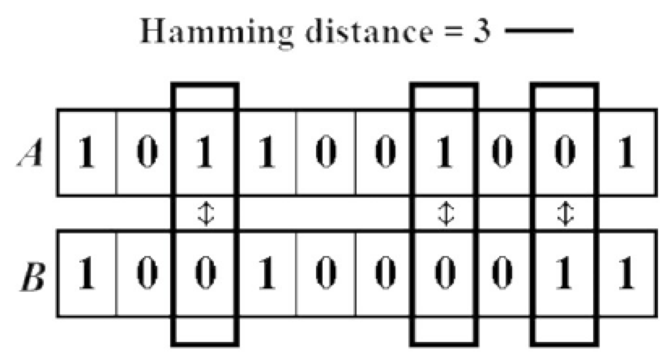
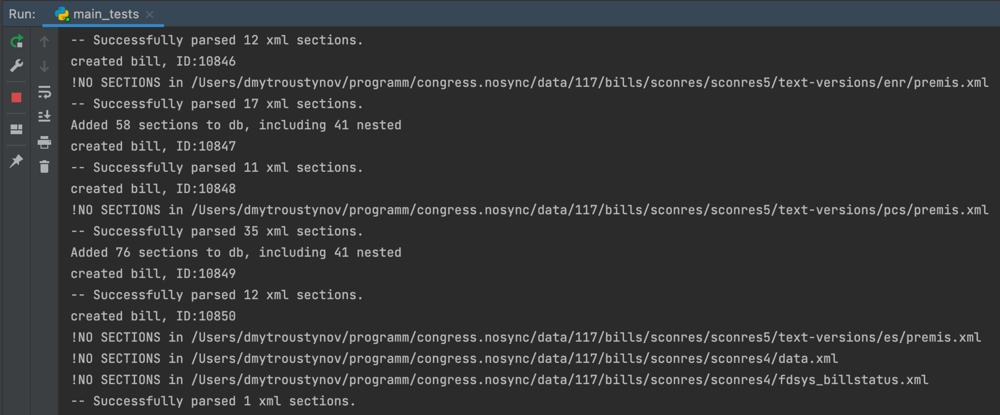

= Ivestigation of similarities search with Simhashes
:toc:

== Brief description
This folder contains data, scripts, utilities and materials on investigation of similarity search within Bills using simhash approach.

== Simhash explanation
Searching for near similar documents among large corpus of texts is quite often task and to solve it different types of hashing are widely used in search engines such as Google, Netflix etc. or plagiarism detection.

We use here the SimHash algorithm.

The SimHash algorithm is a locality-sensitive hashing algorithm. Locality-sensitive means that instead of the algorithm being sensitive to variations in the input stream like a cryptographic hashing algorithm (SHA, MD5), it ignores variations (to a degree) and groups similar content together. Similar input strings will get similar or even the same hashes.

SimHash works by breaking the input string into k-grams and producing a fixed-sized shingle for each k-gram. This algorithm under the hood convert every k-gram to integer with simple arithmetic and bit operations and has an integer number as a result. It works pretty fast in terms of machine operations.

=== Comparison
SimHash values can be compared as integer numbers or as binary numbers to determine similarity.
XOR operation between two binary numbers will result in a string, which has 0 when bits are equal and 1 if bits differs. Counting 1s in bit string we get a Hamming distance - the measure how different two bit sequences.

=== Hamming distance

The Hamming Distance just identifies the number of bits that differ between the binary representations of two hashes.
The calculation of Hamming distance also can perform very fast on the DB side.

For now, we have 64-bit long hashes, and we assume that the hamming distance between two similar texts should be not more than 6 (it’s configurable value).

This means the two SimHash values are only 9% different (6/64=0.09375), or 91% similar. Therefore, the lower the Hamming Distance, the more similar the files.

=== Implementation
To find near similar documents (bills or similar sections/subsections) we calculate the SimHashes of every document and store them in DB.
The main idea to perform search of similars with DB functionality - *BIT_COUNT()* function.

BIT COUNT performs a bit operation with result of XOR between to hashes, and it is quite fast.
A xor B aka `A ^ B` is operation for counting Hamming distance between `A` and `B`.

Hash of the text is a locality sensitive hashing functions.
In contrary to crypto hashes (SHA, MD5), where even small change of the input leads to significant changes of the output result of the hash function,
locality sensitive hashing function operates in opposite way and mostly insensitive to minor changes of the input string.

Under the hood it may work with ngrams of the input text or with text shingles.
We've tested both approaches, and found, that using ngrams is better.

The process of hashing is quite close to counting bit average of hashes among all the input ngrams/shingles.
This way, mostly similar texts will have very close or even the same hashes.
If we have 128 bit length hash, we can consider two input texts very similar if their hashes have the Hamming distance less than 12 : 12 different bits among 128 means 9.3% difference or 90.7% similar.

And this measure of the similarity is adjustable - the larger Hamming distance threshold, the wider range of similar texts we can find.
E.g. for distance 35/128 we will have all texts that have 80.5% of similarity (19.5% difference) and so on.

== 4 steps to success
How to walk through all the flow and reproduce locally.

=== 1. Create environment and install dependencies

Run `pip install -r investigate/requirements.txt`

=== 2. Establish DB connection

We assume that you already have a PostgreSQL database, but if not yet, you may want to see https://hub.docker.com/_/postgres[this link] and find how to up the PostgreSQL in docker. Starting it you must use the same credentials that you use in config.

Create config file from the template:
`cp investigate/config.yaml.template config.yaml`

Then type into `config.yaml` your credentials to connect to PostgreSQL database:

----
user: <your_db_user_name>
password: <your_password>
----

Create DB tables with command:
----
python investigate/main_test.py -create_db
----

It will create three db tables according to ORM models classes that are in `investigate\bill.py` : `Bill`, `Section` and `BillPath`.

Names for DB_tables stored in `config.yaml` , so keep it default during all the flow, or change it to your names and all operations will be held with those tables you specified.

==== Schema description
Table `xml_bills` - for storing Bills
|===
|Column name |Column type |Description/Example value

|id
|Integer
|Primary Key

|title
|text
|title of the bill

"117 HR 7323 IH: Expanding Reentry Employment Assistance Act"

|bill_text
|text
| Full text of the bill

|simhash_title
|bit(128)
|SimHash of the title to search for similar titles, 128 bit length

|simhash_text
|bit(128)
|SimHash of the text to search for similar bills, 128 bit length

|origin
|string(255)
|Unique identifier of the bill; to keep relation between file/bill/section
"BILLS_117hr_hr4512_ih_mods.xml"

|pagenum
|integer
|<null> reserved for further usage

|label
|string(255)
|<null> reserved for further usage

|xml_id
|integer
|ID, parsed from the top xml tag of the bill
"H7735BA0F363046C5A560C2CC43E66ED2"

|parent_bill_id
|integer
|<null> reserved for further usage, if bill entities could have tree structure with nested bills

|meta_info
|JSON
| Additional info parsed from xml file to save for further usage

{"resolution-stage": "Introduced-in-House", "dms-id": "H7735BA0F363046C5A560C2CC43E66ED2", "public-private": "public", "resolution-type": "constitutional-amendment", "star-print": "no-star-print", "key": "H", "xml_date": "2021-10-12"}

|created
|timestamp
|Created time
|===

Table `sections` - for storing sections

|===
|Column name |Column type |Description/Example value

|id
|Integer
|Primary Key

|bill_id
|integer
|<null> reserved field for foreign relations between bill - section

|bill_origin
|string(255)
|Unique identifier of the bill; to keep relation with file/bill/section
"BILLS_117hconres_hconres11_pcs_document.xml"

|text
|text
|Cleaned text of the section

"(b) Special rule
In the House of Representatives and the Senate, for purposes of enforcing section 302(f) of the Congressional Budget Act of 1974 ( 2 U.S.C. 633(f) ), estimates of the level of total new budget authority and total outlays provided by a measure shall include any discretionary amounts described in subsection (a)."

|section_id
|string(255)
| xml_id of the section parsed from xml file
"H8DE0ED3AF5064A17A573F4ADFA7D2D51"

|parent_id
|string(255)
|May be <null> - means the section has no subsections. If not null - xml_id of the parent xml tag

"HE806C7B285714CF39CEE15714822E5A2"

|label
|string(200)
|<null> reserved for further usage

|header
|string(225)
|May be null, if we can't parse a header from xml. But if we can we store it in this field

"Special rule"

|simhash_text
|bit(128)
|simhash of the section text to search for similar sections, 128 bit length

|hash_ngrams
|bit(128)
|variation of simhash created with ngrams. used for testing purposes to check how different types of building simhash influence on search results

|hash_words
|bit(128)
|Variation of simhash created with text shingles. Used for testing purposes to check how different types of building simhash influence on search results

|pagenum
|integer
|<null> reserved field

|length
|integer
|length of the section's text

|created
|timestamp
|Created timestamp
|===

Table `bill_path` - for storing pathes of processed files

|===
|Colmn name |Column type | Description/Example value

|id
|Integer
|Primary Key

|origin
|string(255)
|Unique identifier of the bill; to keep relation with file/bill/section
"BILLS_117hconres_hconres11_pcs_document.xml"

|full_path
|string(255)
|Path of the file on disk
"/programm/congress.nosync/data/117/bills/hjres/hjres60/text-versions/ih/document.xml"
|===

==== Indexes

Add indexes to db tables with this command:
(TBD)

=== 3. Fix folder names/ paths

Since all xml bills are not included to this repo it is supposed that you already have them so just specify in the script from which folder you want to load and parse them.

Provide correct full path to all bills in `config.yaml`

It may look like:
`CONGRESS_ROOT_FOLDER: &#39;/Users/dmytroustynov/programm/congress.nosync/data&#39;`

=== 4. Run the script

You may load DB with bills , with sections, or both them at once.

To load bills run the command:
`python investigate/main_tests.py -bills`

To load sections run the command:
`python investigate/main_tests.py -sections`. This also creates corresponding _bill_path_ entities to link sections, files, and their path on your disk.

To load them all:
`python investigate/main_tests.py -all`. This will create all data in a single run: bills, sections and their paths

It will take some time to proceed all files and load &gt; 100k entities to DB, so be patient and let the script run.

Pic. - Example of output while script is running and printing results.

---
*WARNING:*
There is no protection of unique texts/hashes yet or any other check if the text/section was already loaded to the DB table or not.
So run previous commands only once, or truncate the table first or otherwise, you will create a lot of duplicates, and a further search of similar will produce a bunch of noise results.

*TODO:* Make script runnable incrementally, add uniqueness check by bill_name + bill_number / section_id   etc. So we can run the script without making duplicate entities

*TODO:* Make script runnable for single bill (by name , bill_number, etc.) or for a bunch of bills ( by some filter etc.)

== Useful utils

All utility functions are in `investigate\utils.py`.
Text cleaning, establishing connection to DB, reading files from folder, building simhashes etc.

Also added an implementation for 128bit hash of fnv-1a hashing function, which is quite useful for SimHash due to its simplicity and swift operation.

== Test search

Once DB is loaded with bill and section texts, you can test how the similarity search works running `investigate\test_search.py` with different values
or adding similar texts to find by hand.
It works among bills, but may also perform search among sections.

Or you may want to try queriing DB manually.
Here are several examples of queries to search for similar entities:

----
SELECT * FROM xml_bills
WHERE bit_count(simhash_text # b'11100010000110010011001000001110000111010011110001100100101111110110111100010100110000110010001100100001010100101101000001000110') < 12
----
As you see, the pattern is:
----
SELECT * FROM <table> WHERE bit_count(<field> # b'<bit_value>') < <threshold>
----
<table> values are `xml_bills` to search similar bills or `sections` to search similar sections;

<field> values are `simhash_text` , `simhash_title` for bill table;
`simhash_text` (best choice), `hash_ngrams`, `hash_words` (just for testing) for sections table;

<bit_value> - is the bit string value of the corresponding field of the bill we want to find similar to. PostgreSQL performs XOR (A # B) operation only for strings with equal length.

<threshold> - is the adjustable value of similarity, as it was described above.
The larger the threshold the more similar documents we can find. Try the previous query with threshold 18 (`... <18`) and check the difference of results.

Also, you may add this value to the query to see how different db_entities you are querying:
----
SELECT bit_count(simhash_text # b'<bit_value>') as diff,  b.* FROM xml_bills as b
WHERE bit_count(simhash_text # b'<bit_value>') < 12
----

Entities with diff==0 are at least 99.3% equal (for hashes with length 128 bit), and in most cases has identical texts in the field for which hash was build.

Adding `ORDER BY diff` in the end of the query will sort the results from most similar (first document itself with difference 0), to less similar. So the most N similar documents will be in the top.

== Further implementation

Once we want to integrate SimHash approach into billsim project (or any other where we want to implement near similar search among texts/documents) here the RoadMap on how to do this.

1. Alter existing tables - add simhash field(s)
2. Update env with new dependencies: simhash, fnvhash, etc
3. Fill this new field(s) for existing entities  with calculated simhash values. To build simhashes, texts of the entities are required, so we need to parse them again, or get them somewhere.
4. Add calculating simhashes in the flow where we create and save new entities to DB. (better option)

As an alternative for p.4 in order to not interfere too much in the code of existing project, we can add another procedure (task) to the existing pipeline of creating/saving/processing new data in our storage, which will calculate simhash and update data for newly created  DB instances as a separate process.